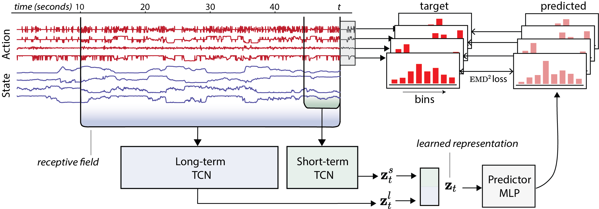

# Relax, it doesn't matter how you get there: A new self-supervised approach for multi-timescale behavior analysis (NeurIPS 2023)



This is the official PyTorch implementation of BAMS in 'Relax, it doesn't matter how you 
get there: A new self-supervised approach for multi-timescale behavior analysis' 
(NeurIPS 2023).

This repo contains examples of training BAMS on the Multi Agent Behavior Challenge (MABe) 
datasets, which are benchmark datasets that provide a rich set of labels to evaluate the 
quality of the learned representations. The main scripts for these datasets will be 
`mouse_triplets.py` and `fruit_flies.py`.

BAMS is a general purpose self-supervised learning method for behavior analysis, and does
not require labels. To train BAMS on your own dataset, please refer to `custom_dataset.py`.

Data and scripts for the Simulated Quadrupeds Dataset can be found here: https://github.com/nerdslab/bams_simulated_quadrupeds

### Setup

Clone this repository:
```bash
git clone https://github.com/nerdslab/bams.git
```

To set up a Python virtual environment with the required dependencies, run:
```bash
python3 -m venv bams_env
source bams_env/bin/activate
pip install --upgrade pip
pip install -e .
```

## Mouse Triplet experiments
To see an example of training and evaluating BAMS end-to-end, please follow the steps below to test BAMS on the Mabe mouse triplets challenge.

### 1. Downloading the MABe data

The [MABe 2022](https://sites.google.com/view/computational-behavior/our-datasets/mabe2022-dataset)
trajectory is publically available.
Run the following script to download the MABe data (both mouse triplet and fruit fly datasets):
```bash
bash download_mabe.sh
```
### 2. Model training
To start training, run:
```bash
python3 mouse_triplets.py --job train
```

You can track the runs in Tensorboard:
```bash
tensorboard --logdir runs
```

To compute the learned representations and save them to a file, run:
```bash
python3 mouse_triplets.py --job compute_representations --ckpt_path ./bams-mouse-triplet-[datetime].pt
```
Note that you will have to adjust the filename, since each checkpoint (and sumbmission) name contains [datetime].

### 3. Linear evaluation 
For linear evaluation of the learned representations, we will use the public
MABe evaluator:
```bash
cd mabe-2022-public-evaluator/
python3 round1_evaluator.py --task mouse --submission ../bams-mouse-triplet-[datetime]_submission.npy --labels ../data/mabe/mouse_triplets_test_labels.npy
```

## Custom datasets
If you'd like to train BAMS on your own dataset, you may use `custom_dataset.py` or `custom_dataset_w_labels.py`. `custom_dataset.py` 
allows you to train BAMS in the most simple way, and only requires loading in your keypoints. `custom_dataset_w_labels.py` has the added functionality of evaluating your model on downstream classification or regression tasks during training and saving them to tensorboard. For this approach you must also load in your annotations as well as some metadata (further directions in `custom_dataset_w_labels.py`). 

### 1. Model training
To train a model using `custom_dataset.py`, you will need to simply load your `keypoints` object which should be of shape `(n_samples, seq_len, num_feats)`. Fill in the `load_data()` function at the top of `custom_dataset.py`.

To train a model using `custom_dataset_w_labels.py`, you will need to load your `keypoints` object which should be of shape `(n_samples, seq_len, num_feats)`. You must also load in your annotations/labels. This script supports linear readouts of behavior for both **frame-level** (labeled per frame) and **sequence-level** (labeled per sequence) labels. Your annotations should be loaded in a specific dictionary format, specified in `custom_dataset_w_labels.py`. You must specify whether each label should be classified or regressed and is frame or sequence-level in the given format. Fill in the `load_data()` and  `load_annotations()` functions at the top of `custom_dataset_w_labels.py`.

This script will automatically fit a linear classifier or regressor to each label, either per sequence or per frame depending on the timescale of the labels. Confusion matrices and regression loss will be directly saved to tensorboard.

**Note:**  If you have missing values, or need to pad your data to the same length, please use `np.nan`
as the missing value.

### 2. Extract the embeddings

```
embs, hoa_pred, byol_preds = model(input)
```
embs is a dict with embs['short_term'] and embs['long_term'] containing both the short-term and long-term latent embeddings

## Example notebooks
We have included an example notebook, `visualize_latents.ipynb`, which illustrates how you can visualize BAMS embeddings using PCA to gain further insight into your data.
